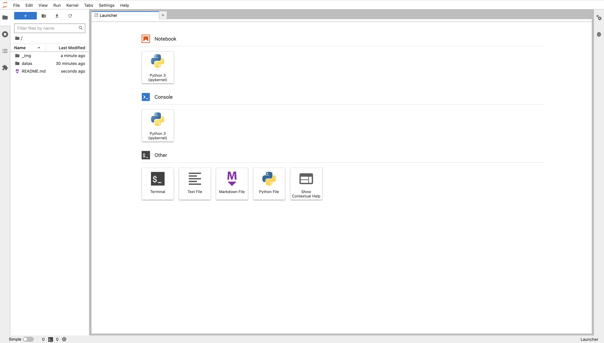
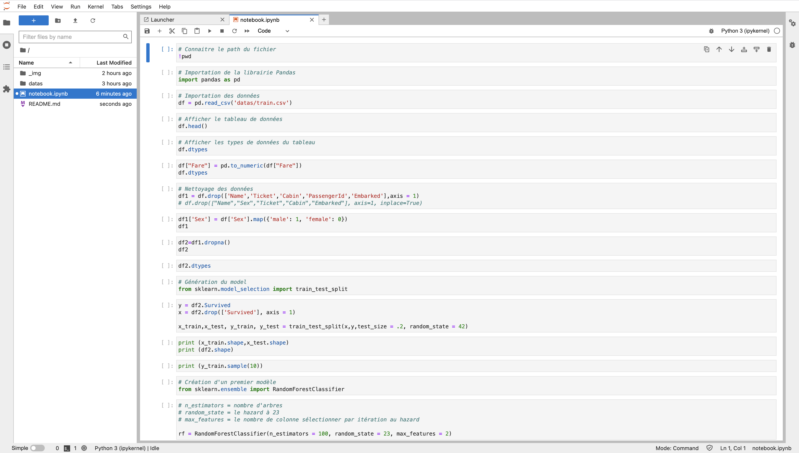
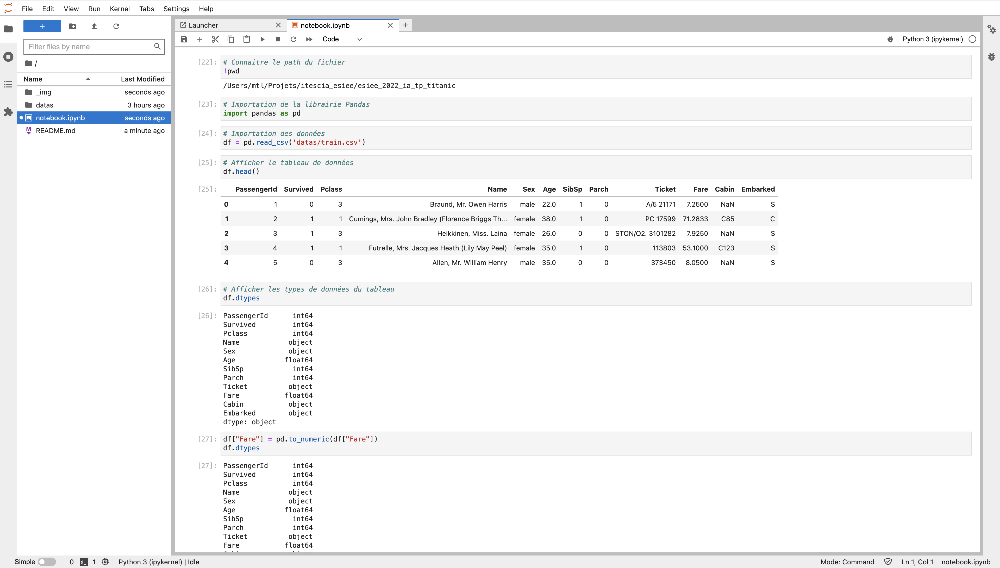

# ESIEE - 2022 - IA - TP - Titanic
 
## 1 - Jupyter - Installation des dépendances

[source](https://jupyter.org/install)

### 1.1 - Mise à jour de pip.

```
pip3 install --upgrade pip
```

### 1.2 - Installation de la librairie Jupyter

```
pip3 install jupyterlab
```

### 1.3 - Installation de librairies utiles

```
pip3 install pandas
pip3 install pandas-profiling
pip3 install random-forest-mc
pip3 install scikit-learn
pip3 install shap
```

### 1.4 - Construction de Jupyter

```
jupyter lab build
```

### 1.5 - Démarrer Jupyter

```
jupyter-lab
```

Ouvrir normalement automatique une page web : http://localhost:8888/lab.



## 2 - Jupyter - Utilisation

## 2.1 - Création et utilisation d'un **Notebook**

### 2.1.2 - Qu'est-ce qu'un Notebook dans Jupyter

Un document Jupyter Notebook est un document JSON. Il suit un schéma contenant une liste ordonnée de cellules d'entrée/sortie. Celles-ci peuvent contenir du code, du texte (à l'aide de Markdown), des formules mathématiques, des graphiques et des médias interactifs. Ce document se termine généralement par l'extension ".ipynb".

[Source - wiki](https://fr.wikipedia.org/wiki/Jupyter#Jupyter_Notebook)

### 2.1.1 - Exemple de création et de lecture d'un fichier Notebook



> Fichier de démo --> [**notebook_001.ipynb**](notebook_001.ipynb)

### 2.1.1 - Exemple d'exécution d'un fichier Notebook



> Fichier de démo --> [**notebook_001.ipynb**](notebook_001.ipynb)

## 2.2 - Notebook disponibles

1. [**notebook_001.ipynb**](notebook_001.ipynb)
2. [**notebook_002.ipynb**](notebook_002.ipynb)